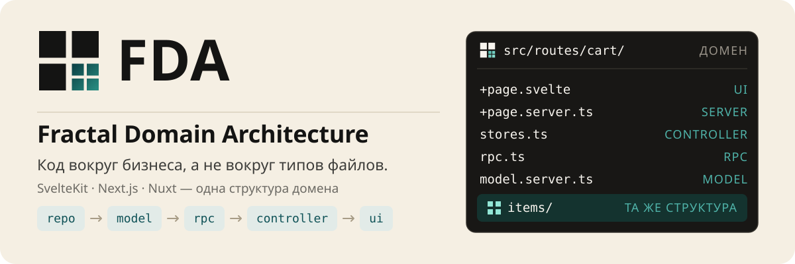

<div align="center">

<picture>
  <source media="(prefers-color-scheme: dark)" srcset="./assets/readme/hero-dark.svg">
  
</picture>

# FDA

**Fractal Domain Architecture** — архитектура для приложений на метафреймворках вроде SvelteKit, Next.js и Nuxt.

Код организуется вокруг бизнес-доменов, а не вокруг технических типов файлов. Внутри каждого домена — одинаковый набор слоёв и контрактов, и эта структура повторяется от компонента до приложения.

<a href="https://kit.svelte.dev"></a>
<a href="https://svelte.dev"></a>
<a href="https://www.typescriptlang.org"></a>
<a href="https://orm.drizzle.team"></a>
<a href="./LICENSE"></a>

</div>

## Что это

По мере роста проекта код, разложенный по техническим папкам (`components/`, `hooks/`, `utils/`), превращается в кашу: логика одной фичи размазана по всему проекту, и «где лежит корзина» не отвечает никто. FDA разворачивает организацию вокруг бизнеса — код живёт в доменах `cart`, `auth`, `dashboard`, и у каждого одинаковая внутренняя структура:

- **Фрактальность** — одинаковая структура на всех уровнях: компонент → субдомен → домен → приложение.
- **Слои** — внутри домена данные проходят один путь: repo → model → RPC → контроллер → UI, импорты смотрят только вниз.
- **Явные контракты** — каждый файл имеет одну роль и один набор экспортов.
- **Framework-agnostic** — SvelteKit, Next.js и Nuxt различаются именами файлов роутинга, но не структурой.

Для лендингов и прототипов FDA избыточна. Архитектура окупается на проектах среднего размера и выше, где бизнес-домены различимы и проект живёт дольше одного спринта.

## Как выглядит домен

```text
src/routes/cart/          # домен «корзина»
├── +page.svelte          # UI: разметка
├── +page.server.ts       # server load и actions
├── stores.ts             # контроллер: реактивное состояние
├── rpc.ts                # API для других доменов
├── model.server.ts       # операции с данными
└── items/                # субдомен — та же структура внутри
```

Каждый файл имеет контракт: `model.server.ts` — только операции с данными, `types.ts` — только типы, `policy.ts` — только правила доступа. Домены общаются между собой только через `rpc.ts` соседа — остальное считается внутренностями и можно менять, не спрашивая соседей. Живой разбор домена `cart` — в [документации](https://fda-docs.com/).

## Документация

Публикуется на **https://fda-docs.com**:

1. [Введение](https://fda-docs.com/01-introduction/) — зачем нужна FDA и для каких проектов подходит
2. [Основные концепции](https://fda-docs.com/02-core-concepts/) — фрактальность, слои, контракты
3. [Структура проекта](https://fda-docs.com/03-project-structure/) — дерево каталогов и «куда положить код»
4. [Домены и субдомены](https://fda-docs.com/04-domains-subdomains/) — уровни вложенности и взаимодействие модулей
5. [Контракты файлов](https://fda-docs.com/05-file-contracts/) — роль каждого файла с примерами из живого кода
6. [Кросс-доменное взаимодействие](https://fda-docs.com/06-cross-domain-interactions/) — родитель и потомок, соседние домены, публичный вход
7. [FAQ и чеклист](https://fda-docs.com/07-faq-checklist/) — проверка модуля перед мержем
8. [Скилл для AI-агентов](https://fda-docs.com/08-qwen-code-skill/) — правила FDA для Qwen Code, Claude Code и других

## Скилл для AI-агентов

FDA доступна как устанавливаемый скилл по кросс-агентному стандарту `.agents/skills`:

```bash
mkdir -p .agents/skills/fda
```

Скопируйте [полный текст скилла](https://fda-docs.com/08-qwen-code-skill/#-полный-текст-скилла) в `.agents/skills/fda/SKILL.md` и перезапустите сессию агента. После установки агент собирает домены по контракту, ловит нарушения слоёв на ревью и адаптирует правила под ваш стек.

## Примеры

| Приложение | Фреймворк | Статус |
|------------|-----------|--------|
| [`apps/example-sveltekit`](apps/example-sveltekit) | SvelteKit | ✅ домен `cart` |
| [`apps/example-next`](apps/example-next) | Next.js | 🚧 в работе |
| [`apps/example-nuxt`](apps/example-nuxt) | Nuxt | 🚧 в работе |

## Быстрый старт

```bash
git clone https://github.com/chord-ts/fda.git
cd fda
pnpm install

pnpm dev                              # документация
pnpm --filter example-sveltekit dev   # пример корзины
```

## Лицензия

[MIT](./LICENSE) © Din Dmitriy
