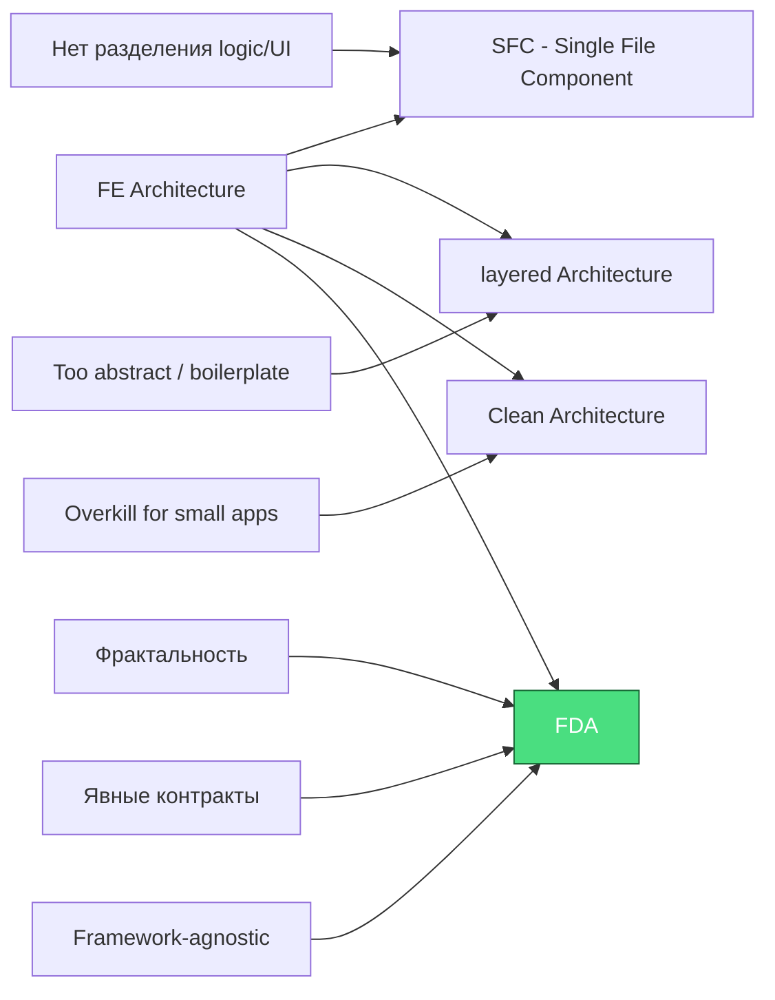

**FDA (Fractal Domain Architecture)** — это архитектурный подход к построению сложных приложений, основанный на принципах фрактальности, строгом разделении ответственности и явном управлении зависимостями.

---

### Основные принципы FDA:

| Принцип | Описание |
|---------|----------|
| **Фрактальность** | Одинаковая структура на всех уровнях абстракции: компоненты → подмодули → домены → приложения |
| **Разделение на слои** | Четкое разделение: репозитории → модель → контроллер → состояние → UI |
| **Явные контракты** | Каждый файл имеет строго определенную роль и экспорты |
| **Framework-agnostic** | Архитектура независима от мета-фреймворка (SvelteKit/Nuxt/Next) |

---

## 🏗️ Почему FDA?

- Каждый файл делает ОДНУ вещь и делает её хорошо
- Явные зависимости через публичные интерфейсы
- Предсказуемая структура позволяет легко найти код
- Слабая связанность при высоком сцеплении бизнес логики
- Легко мигрировать как от других архитектур, так и в разбиение на микросервисы

---

## 📋 Сравнение с другими архитектурами

---

## 🚀 Начало работы

Эта документация охватывает:

1. **Основные концепции** — фундаментальные идеи FDA
2. **Структура проекта** — как организовать файлы
3. **Домены и подмодули** — фрактальная организация и связывание 
4. **Контракты файлов** — определяем зоны функциональной ответственности
5. **Поток данных** — как двигаются данные в проекте
6. **FAQ и Checklist** — частые вопросы и проверки

---

## 🔗 Следующие шаги

→ [Основные концепции](/02-core-concepts) — изучите фрактальность и разделение на слои

→ [Создайте ваш первый домен](/04-domains-submodules) — практическое руководство

## 🧪 Рабочие примеры

Примеры FDA реализованы на разных фреймворках, чтобы показать framework-agnostic подход:

| Пример | Фреймворк | Статус | Ссылка |
|--------|-----------|--------|--------|
| `example-sveltekit` | SvelteKit | ✅ Готов | [код](https://github.com/dmdin/fda/tree/main/apps/example-sveltekit) |
| `example-next` | Next.js | 🚧 Скоро | [код](https://github.com/dmdin/fda/tree/main/apps/example-next) |
| `example-nuxt` | Nuxt | 🚧 Скоро | [код](https://github.com/dmdin/fda/tree/main/apps/example-nuxt) |
