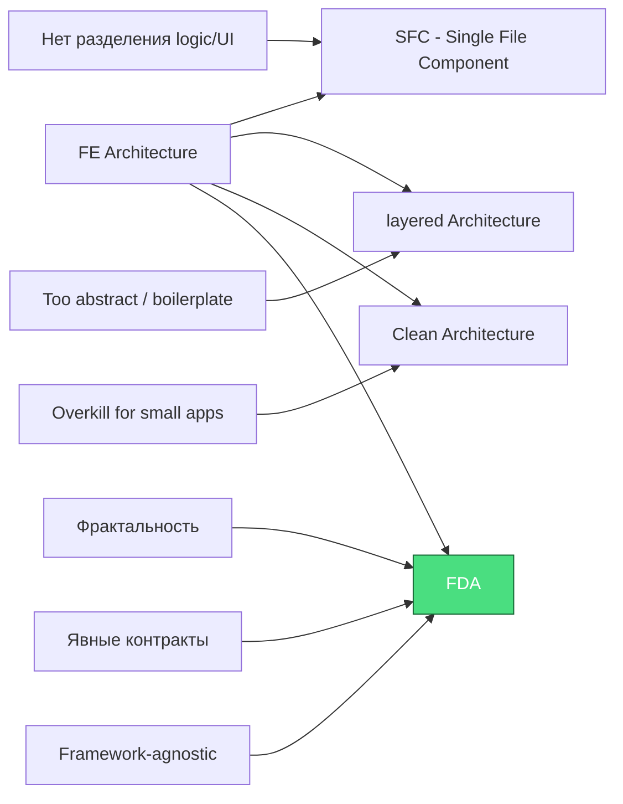

# Введение в FDA (Fractal Domain Architecture)

**FDA (Fractal Domain Architecture)** — это архитектурный подход к построению сложных приложений, основанный на принципах фрактальности, строгом разделении ответственности и явном управлении зависимостями.

---

## 🔍 Что такое FDA?

FDA — это не просто структура папок, а **парадигма организации кода**, которая масштабируется от простых компонентов до целых доменов приложения, сохраняя единообразие и предсказуемость.

### Основные принципы FDA:

| Принцип | Описание |
|---------|----------|
| **Фрактальность** | Одинаковая структура на всех уровнях: компоненты → подмодули → домены → приложения |
| **Разделение на слои** | Четкое разделение: репозитории → модель → контроллер → UI |
| **Явные контракты** | Каждый файл имеет строго определенную роль и экспорты |
| **Framework-agnostic** | Архитектура независима от фреймворка (Astro/SvelteKit/React/Vue) |

---

## 🏗️ Почему FDA?

### Проблемы традиционной архитектуры:

```
❌ Смешение ответственности (микс actions, logic, UI)
❌ Неявные зависимости (импорты из любого места)
❌ Сложность масштабирования (все в one-big-file)
❌ Отсутствие границ доменов (everything is connected to everything)
```

### Решение от FDA:

```
✅ Каждый файл делает ОДНУ вещь и делает её хорошо
✅ Явные зависимости через контроллеры/модели
✅ Легко найти код (структура предсказуема)
✅ Легко тестировать (слабая связанность)
✅ Легко мигрировать между фреймворками
```

---

## 🎯 Актуальность FDA

FDA особенно полезна для:

| Сценарий | Почему FDA |
|----------|------------|
| **Микросервисы** | Изолированные домены, чёткие API между ними |
| **Монолиты с доменами** | Легко выделять области ответственности |
| **Масштабирование команд** | Разные команды работают в разных доменах без конфликтов |
| **Долгоживущие проекты** | Легко поддерживать и рефакторить |

---

## 📋 Сравнение с другими архитектурами



---

## 🚀 Начало работы

Эта документация охватывает:

1. **Core Concepts** — фундаментальные идеи FDA
2. **Project Structure** — как организовать файлы
3. **Domains & Submodules** — фрактальная организация
4. **File Contracts** — контракты каждого файла
5. **Data Flow** — как двигаются данные
6. **FAQ/Checklist** — частые вопросы и проверки

---

## 🔗 Следующие шаги

→ [Основные концепции](/02-core-concepts) — изучите фрактальность и разделение на слои

→ [Создайте ваш первый домен](/04-domains-submodules) — практическое руководство

## 🧪 Рабочие примеры

Полные рабочие примеры находятся в [`examples/`](https://github.com/your-org/fda/examples):

| Пример | Размер | Описание |
|--------|--------|----------|
| `minimal/` | 🟢 | Минимальный пример с одним модулем |
| `base/` | 🟡 | Базовая структура с несколькими модулями |
| `e-commerce/` | 🔴 | Полный пример интернет-магазина |
| `auth/` | 🔴 | Пример системы авторизации |
| `dashboard/` | 🔴 | Пример аналитического дашборда |

→ [Посмотреть примеры](https://github.com/your-org/fda/examples)
