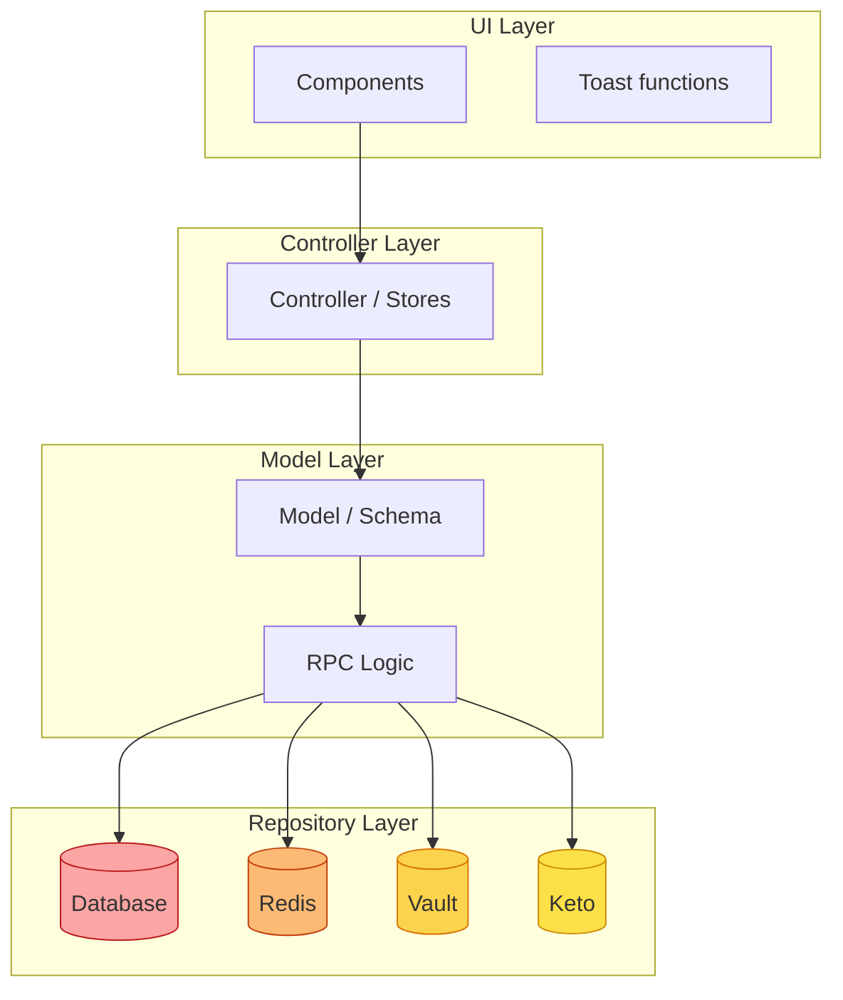
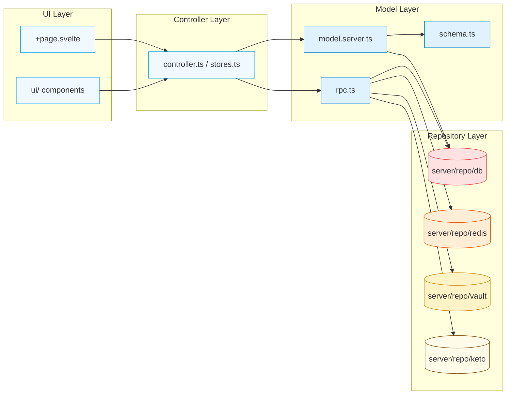
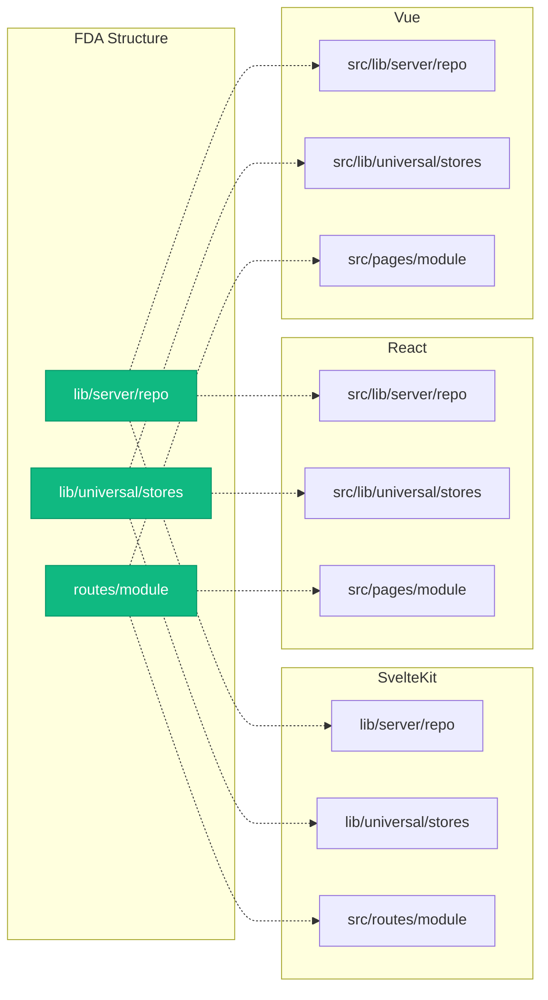

# Основные концепции FDA

---

## 🌀 Фрактальность

**Фрактальность** — это принцип, при котором структура на одном уровне повторяется на всех других уровнях.

### Масштабы фрактальности в FDA:

```
┌─────────────────────────────────────────────────────────────┐
│                     APPLICATION LEVEL                       │
│  ┌─────────────┐  ┌─────────────┐  ┌─────────────┐         │
│  │   module1   │  │   module2   │  │   auth      │         │
│  │  ┌─────────┐│  │  ┌─────────┐│  │  ┌─────────┐│         │
│  │  │ model   ││  │  │ model   ││  │  │ model   ││         │
│  │  │ repo    ││  │  │ repo    ││  │  │ repo    ││         │
│  │  │ rpc     ││  │  │ rpc     ││  │  │ rpc     ││         │
│  │  └─────────┘│  │  └─────────┘│  │  └─────────┘│         │
│  └─────────────┘  └─────────────┘  └─────────────┘         │
└─────────────────────────────────────────────────────────────┘
                         ↓ (same structure)
┌─────────────────────────────────────────────────────────────┐
│                      MODULE LEVEL                           │
│  ┌──────────────────────────────────────────────────────┐   │
│  │  <module>                                            │   │
│  │  ┌────────────────────────────────────────────────┐  │   │
│  │  │  +page.svelte (+layout.svelte)                 │  │   │
│  │  │  +page.server.ts (+layout.server.ts)           │  │   │
│  │  │  rpc.ts                                        │  │   │
│  │  │  model.server.ts                               │  │   │
│  │  │  controller.ts / stores.ts                     │  │   │
│  │  │  policy.ts                                     │  │   │
│  │  │  utils.ts                                      │  │   │
│  │  │  types.ts                                      │  │   │
│  │  │  templates.ts                                  │  │   │
│  │  │  constants.ts                                  │  │   │
│  │  │  index.ts                                      │  │   │
│  │  │  ui/                                           │  │   │
│  │  └────────────────────────────────────────────────┘  │   │
│  └──────────────────────────────────────────────────────┘   │
└─────────────────────────────────────────────────────────────┘
                         ↓ (same structure)
┌─────────────────────────────────────────────────────────────┐
│                   SUBMODULE LEVEL                           │
│  ┌──────────────────────────────────────────────────────┐   │
│  │  _<submodule> (internal only)                      │   │
│  │  <submodule> (page + internal)                     │   │
│  │  [same structure as module level]                  │   │
│  └──────────────────────────────────────────────────────┘   │
└─────────────────────────────────────────────────────────────┘
```

### Практический пример:

```
src/
├── lib/                      # Фреймворк-agnostic код
│   ├── server/               # Серверные утилиты
│   │   └── repo/             # Внешние источники
│   │       ├── db/           # База данных
│   │       ├── redis/        # Кэш
│   │       ├── vault/        # Секреты
│   │       └── keto/          # Авторизация
│   ├── universal/            # Общий код
│   └── stores/               # Глобальное состояние
│       ├── navigation.ts
│       ├── user.ts
│       └── theme.ts
│
└── routes/                   # Framework-specific pages
    └── (auth)/
        ├── login/
        │   ├── +page.svelte
        │   ├── +page.server.ts
        │   ├── rpc.ts
        │   ├── model.server.ts
        │   ├── controller.ts
        │   └── index.ts
        └── profile/
            └── [id]/         # Динамические роуты
                ├── +page.svelte
                └── index.ts
```

---

## 📊 Слоистая архитектура (Layered Architecture)

Каждый домен/модуль имеет **строгое разделение на слои**:



### Ответственность каждого слоя:

| Слой | Файлы | Ответственность | Запреты |
|------|-------|-----------------|---------|
| **UI** | `+page.svelte`, `ui/` | Отображение, пользовательский ввод | Нет прямых импортов `repo/*` |
| **Controller** | `controller.ts`, `stores.ts` | Управление состоянием, реактивность | Нет прямых импортов внешних источников |
| **Model** | `model.server.ts`, `schema.ts` | Логика работы с данными | Нет UI-логики |
| **RPC** | `rpc.ts` | Бизнес-логика, API между модулями | Нет прямых импортов UI |
| **Repo** | `server/repo/*` | Подключение к внешним источникам | Нет бизнес-логики |

---

## 📄 Явные контракты (File Contracts)

Каждый файл имеет **строго определённую роль и набор экспортов**:

### ✅ Что экспортирует каждый файл:

#### `schema.ts` (ONLY in Drizzle ORM)
```typescript
// Строго: только схемы для ORM
// Никакой логики, только таблицы/колонки
export const users = pgTable(...)
export const posts = pgTable(...)
```

#### `model.server.ts`
```typescript
// Логика работы с данными через repo
// Экспортирует CRUD операции, валидацию, транзакции
export const getUserById = async (id: string) => { ... }
export const createUser = async (data: CreateUserInput) => { ... }
```

#### `rpc.ts`
```typescript
// Бизнес-логика модуля/сабмодуля
// Экспортирует API endpoints для других модулей
export const authenticateUser = async (credentials: Credentials) => { ... }
export const generateToken = async (userId: string) => { ... }
```

#### `controller.ts` / `stores.ts`
```typescript
// Работа с UI-состоянием
// Экспортирует реактивные stores и утилиты для UI
export const userStore = derived(...)
export const navigateToProfile = (userId: string) => { ... }
```

#### `policy.ts`
```typescript
// Описание политик авторизации
// Экспортирует правила доступа
export const canEditUser = (user: User, target: User) => { ... }
export const policy = { ... }
```

#### `utils.ts`
```typescript
// Вспомогательные функции модуля
// Экспортирует утилиты, не подходящие в другие категории
export const formatUserDisplay = (user: User) => { ... }
```

#### `constants.ts`
```typescript
// Константы и enum
// Экспортирует только const/enum
export const USER_ROLES = { ADMIN: 'admin', USER: 'user' }
export const MAX_UPLOAD_SIZE = 1024 * 1024 * 5
```

#### `templates.ts`
```typescript
// Шаблоны форм и состояний
// Экспортирует структуры для formik/yup или аналогов
export const userFormSchema = object({ ... })
export const initialFormState = { ... }
```

#### `types.ts`
```typescript
// Типы и интерфейсы
// Экспортирует только type/interface
export interface User { ... }
export type AuthResult = { success: boolean; message?: string }
```

#### `index.ts`
```typescript
// Центральный экспорт модуля
// Экспортирует все экспортируемые API
export * from './model.server'
export * from './rpc'
export * from './controller'
export * from './constants'
export * from './types'
```

---

## 🔄 Dependency Flow (Направление зависимостей)



### 🚫 Запрещённые импорты:

```
❌ UI → repo/* (должно идти через model/controller)
❌ UI → rpc/* (должно идти через controller)
❌ UI → model.server/* (должно идти через controller)
❌ Controller → ui/* (UI не должен зависеть от бизнес-логики)
❌ Model → UI (модель не знает про UI)
❌ Model → controller (модель не знает про состояние)
```

### ✅ Правильные импорты:

```
✅ UI → controller (UI использует stores и утилиты)
✅ Controller → model (контроллер управляет данными)
✅ Controller → rpc (контроллер вызывает бизнес-логику)
✅ Model → repo (модель работает с источниками данных)
✅ RPC → model (RPC использует модель)
✅ RPC → repo (RPC работает с источниками)
```

---

## 🏗️ Framework-agnostic vs Framework-specific

### FDA разделяет код на два уровня:

| Уровень | Путь | Описание |
|---------|------|----------|
| **Framework-agnostic** | `src/lib/*` | Код, не зависящий от фреймворка (реиспользуемый) |
| **Framework-specific** | `src/routes/*` | Код, специфичный для Astro/SvelteKit/React |

### Маппинг на другие фреймворки:



### Примеры маппинга:

| FDA | SvelteKit | React | Vue |
|-----|-----------|-------|-----|
| `routes/+page.svelte` | `src/routes/+page.svelte` | `src/pages/...tsx` | `src/pages/...vue` |
| `routes/+page.server.ts` | `src/routes/+page.server.ts` | `src/routes/.../action.ts` | `src/pages/.../setup.ts` |
| `routes/rpc.ts` | `src/routes/module/rpc.ts` | `src/pages/.../rpc.ts` | `src/pages/.../rpc.ts` |
| `lib/stores/user.ts` | `src/lib/stores/user.ts` | `src/lib/stores/user.ts` | `src/lib/stores/user.ts` |
| `lib/server/repo/db.ts` | `src/lib/server/repo/db.ts` | `src/lib/server/repo/db.ts` | `src/lib/server/repo/db.ts` |

---

## 🔗 Следующие шаги

→ [Структура проекта](/03-project-structure) — детальное описание путей и конвенций

→ [Домены и подмодули](/04-domains-submodules) — фрактальная организация кода

→ [Контракты файлов](/05-file-contracts) — полный список обязательных и опциональных файлов
