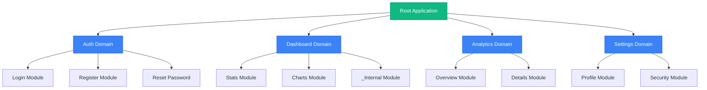

# Домены и подмодули

---

## 🌳 Дерево доменов



---

## 🏗️ Уровни фрактальности

### 1. **Модуль (Module)** — единица функциональности

Модуль — это группа файлов, реализующих определённую функциональность (например, `auth`, `dashboard`, `products`).

#### Структура модуля:

```
module/
├── +layout.svelte
├── +layout.server.ts
├── +page.svelte
├── +page.server.ts
├── rpc.ts
├── model.server.ts
├── controller.ts
├── policy.ts
├── utils.ts
├── types.ts
├── templates.ts
├── constants.ts
├── index.ts
└── ui/
```

#### Пример модуля `auth`:

```
src/routes/(auth)/
├── +layout.svelte
├── +layout.server.ts
├── +page.svelte
├── +page.server.ts
├── rpc.ts
├── model.server.ts
├── controller.ts
├── policy.ts
├── utils.ts
├── types.ts
├── templates.ts
├── constants.ts
├── index.ts
└── ui/
    ├── LoginForm.svelte
    ├── RegisterForm.svelte
    └── Toast.svelte
```

### 2. **Подмодуль (Submodule)** — вложенная функциональность

Подмодуль — это модуль внутри модуля. Имеет свою структуру, но не является отдельной страницей (или является).

#### Типы подмодулей:

| Тип | Путь | Страница | Пример |
|-----|------|----------|--------|
| `_prefix` | `src/routes/module/_analytics/` | ❌ Нет | Внутренние компоненты |
| с префиксом | `src/routes/module/analytics/` | ✅ Да | `/module/analytics` |

#### Примеры:

```
dashboard/
├── _analytics/           # Внутренний подмодуль (без страницы)
│   ├── +page.svelte      # Вложенный роут (не корневой)
│   └── index.ts
│
└── analytics/            # Подмодуль с отдельной страницей
    ├── +page.svelte      # /dashboard/analytics
    └── index.ts
```

---

## 🎯 Создание модуля

### Шаг 1: Создайте структуру папок

```
src/routes/
└── products/
    ├── +layout.svelte
    ├── +layout.server.ts
    ├── +page.svelte
    ├── +page.server.ts
    ├── rpc.ts
    ├── model.server.ts
    ├── controller.ts
    ├── index.ts
    └── ui/
```

### Шаг 2: Определите контракты

#### `+layout.svelte`:

```svelte
<script lang="ts">
  export let data: LayoutData
</script>

<div class="products-layout">
  <h1>{data.title}</h1>
  <slot />
</div>
```

#### `+layout.server.ts`:

```typescript
import type { LayoutLoad } from './$types'

export const load: LayoutLoad = async () => {
  return { title: 'Products' }
}
```

#### `+page.svelte`:

```svelte
<script lang="ts">
  import { PageTitle } from './ui'
  
  export let data: PageData
</script>

<PageTitle>Our Products</PageTitle>
```

#### `+page.server.ts`:

```typescript
import { db } from '$lib/server/repo/db/client'
import { products } from '$lib/server/repo/db/schema'
import { fail } from '@sveltejs/kit'
import type { Actions, PageServerLoad } from './$types'

export const load: PageServerLoad = async () => {
  const items = await db.query.products.findMany()
  return { items }
}

export const actions: Actions = {
  create: async ({ request }) => {
    const formData = await request.formData()
    const name = formData.get('name') as string
    
    // Валидация и создание
    if (!name) {
      return fail(400, { error: 'Name is required' })
    }
    
    await db.insert(products).values({ name })
    
    return { success: true }
  },
}. satisfies Actions
```

#### `rpc.ts`:

```typescript
import { db } from '$lib/server/repo/db/client'
import { products } from '$lib/server/repo/db/schema'
import { eq } from 'drizzle-orm'
import type { Rpc } from '$lib/universal/types'

export const getProductById: Rpc<'products/getById'> = async ({ id }) => {
  const product = await db.query.products.findFirst({
    where: eq(products.id, id),
  })
  
  return product
}

export const listProducts: Rpc<'products/list'> = async ({ limit, offset }) => {
  const items = await db
    .selectFrom('products')
    .selectAll()
    .limit(limit)
    .offset(offset)
    .execute()
  
  return { items }
}
```

#### `model.server.ts`:

```typescript
import { db } from '$lib/server/repo/db/client'
import { products } from '$lib/server/repo/db/schema'
import { eq } from 'drizzle-orm'
import type { Product } from './types'

export const getProducts = async (): Promise<Product[]> => {
  return await db.query.products.findMany()
}

export const getProduct = async (id: string): Promise<Product | null> => {
  return await db.query.products.findFirst({
    where: eq(products.id, id),
  })
}

export const createProduct = async (data: Omit<Product, 'id'>): Promise<Product> => {
  const [product] = await db
    .insert(products)
    .values(data)
    .returning()
  
  return product
}

export const updateProduct = async (
  id: string,
  data: Partial<Product>
): Promise<Product> => {
  const [product] = await db
    .update(products)
    .set(data)
    .where(eq(products.id, id))
    .returning()
  
  return product
}

export const deleteProduct = async (id: string): Promise<void> => {
  await db.delete(products).where(eq(products.id, id))
}
```

#### `controller.ts`:

```typescript
import { derived, writable, type Writable } from 'svelte/store'
import { rpc } from '$lib/universal/rpc'
import type { Product } from './types'

export const productsStore: Writable<Product[]> = writable([])
export const selectedProduct: Writable<Product | null> = writable(null)
export const isLoading = writable(false)

export const loadProducts = async () => {
  isLoading.set(true)
  try {
    const { items } = await rpc('products/list', { limit: 10, offset: 0 })
    productsStore.set(items)
  } finally {
    isLoading.set(false)
  }
}

export const selectProduct = (product: Product | null) => {
  selectedProduct.set(product)
}
```

#### `index.ts`:

```typescript
export * from './model.server'
export * from './rpc'
export * from './controller'
export * from './types'
export * from './constants'
```

---

## 🧩 Создание подмодуля

### Шаг 1: Создайте структуру

```
dashboard/
├── analytics/            # Подмодуль с отдельной страницей
│   ├── +page.svelte
│   └── index.ts
│
└── _reports/            # Внутренний подмодуль (без страницы)
    ├── +page.svelte     # Вложенный роут
    └── index.ts
```

### Шаг 2: Реализуйте

#### `dashboard/analytics/+page.svelte`:

```svelte
<script lang="ts">
  import { PageTitle } from '../ui'
  import { SalesChart } from '../ui/charts'
  import { DailyStats } from '../ui/stats'
  
  export let data: PageData
</script>

<PageTitle>Analytics</PageTitle>

<div class="analytics-grid">
  <DailyStats stats={data.stats} />
  <SalesChart data={data.chart} />
</div>
```

#### `dashboard/analytics/index.ts`:

```typescript
export * from '../model.server'
export * from '../rpc'
```

#### `dashboard/_reports/+page.svelte`:

```svelte
<script lang="ts">
  import { ReportPreview } from '../ui'
  
  export let data: PageData
</script>

<ReportPreview report={data.report} />
```

---

## 🔄 Взаимодействие между модулями

### Импорт API из другого модуля:

```typescript
// src/routes/dashboard/controller.ts
import { getDashboardStats } from './rpc'
import { getUserProfile } from '../profile/rpc'  // Импорт из другого модуля

export const loadDashboard = async (userId: string) => {
  const [stats, profile] = await Promise.all([
    getDashboardStats({ userId }),
    getUserProfile({ userId }),
  ])
  
  return { stats, profile }
}
```

### Использование policy другого модуля:

```typescript
// src/routes/products/policy.ts
import { canViewUser } from '../auth/policy'

export const canEditProduct = (user: User, product: Product): boolean => {
  return canViewUser(user) && (user.role === 'admin' || product.ownerId === user.id)
}
```

---

## 🧪 Пример полного модуля: `auth`

```
src/routes/(auth)/
├── +layout.svelte
├── +layout.server.ts
├── +page.svelte
├── +page.server.ts
├── rpc.ts
├── model.server.ts
├── controller.ts
├── policy.ts
├── utils.ts
├── types.ts
├── templates.ts
├── constants.ts
├── index.ts
└── ui/
    ├── LoginForm.svelte
    ├── RegisterForm.svelte
    ├── Toast.svelte
    └── PasswordInput.svelte
```

### `auth/rpc.ts`:

```typescript
import { db } from '$lib/server/repo/db/client'
import { users } from '$lib/server/repo/db/schema'
import { hash, compare } from '$lib/server/utils/encryption'
import { generateToken } from '$lib/server/utils/jwt'
import type { Rpc } from '$lib/universal/types'

export const authenticateUser: Rpc<'auth/authenticate'> = async ({ email, password }) => {
  const user = await db.query.users.findFirst({
    where: eq(users.email, email),
  })
  
  if (!user) {
    throw new Error('Invalid credentials')
  }
  
  const isValid = await compare(password, user.passwordHash)
  if (!isValid) {
    throw new Error('Invalid credentials')
  }
  
  const token = generateToken({ userId: user.id })
  
  return { token, user: { id: user.id, email: user.email, name: user.name } }
}

export const registerUser: Rpc<'auth/register'> = async ({ email, password, name }) => {
  const existing = await db.query.users.findFirst({
    where: eq(users.email, email),
  })
  
  if (existing) {
    throw new Error('Email already in use')
  }
  
  const passwordHash = await hash(password)
  
  const [user] = await db
    .insert(users)
    .values({ email, passwordHash, name })
    .returning()
  
  const token = generateToken({ userId: user.id })
  
  return { token, user: { id: user.id, email: user.email, name: user.name } }
}
```

### `auth/model.server.ts`:

```typescript
import { db } from '$lib/server/repo/db/client'
import { users } from '$lib/server/repo/db/schema'
import { eq } from 'drizzle-orm'
import type { User } from './types'

export const getUserById = async (id: string): Promise<User | null> => {
  return await db.query.users.findFirst({
    where: eq(users.id, id),
    columns: { id: true, email: true, name: true },
  })
}

export const getUserByEmail = async (email: string): Promise<User | null> => {
  return await db.query.users.findFirst({
    where: eq(users.email, email),
    columns: { id: true, email: true, name: true, passwordHash: true },
  })
}
```

### `auth/controller.ts`:

```typescript
import { derived, writable, type Writable } from 'svelte/store'
import { navigate } from '$lib/universal/stores/navigation'
import { rpc } from '$lib/universal/rpc'
import type { User } from './types'

export const userStore: Writable<User | null> = writable(null)
export const isAuthenticated = derived(userStore, ($user) => !!$user)
export const isLoading = writable(false)

export const login = async (email: string, password: string) => {
  isLoading.set(true)
  try {
    const result = await rpc('auth/authenticate', { email, password })
    userStore.set(result.user)
    navigate('/dashboard')
  } finally {
    isLoading.set(false)
  }
}

export const register = async (email: string, password: string, name: string) => {
  isLoading.set(true)
  try {
    const result = await rpc('auth/register', { email, password, name })
    userStore.set(result.user)
    navigate('/dashboard')
  } finally {
    isLoading.set(false)
  }
}

export const logout = () => {
  userStore.set(null)
  navigate('/login')
}
```

### `auth/policy.ts`:

```typescript
import type { User } from './types'

export const canAccessAuth = (user: User | null): boolean => {
  return !user
}

export const canAccessDashboard = (user: User | null): boolean => {
  return !!user
}
```

---

## 🔗 Следующие шаги

→ [Контракты файлов](/05-file-contracts) — полное описание каждого файла

→ [Data Flow](/06-data-flow) — как двигаются данные

→ [FAQ и Checklist](/07-faq-checklist) — частые вопросы
