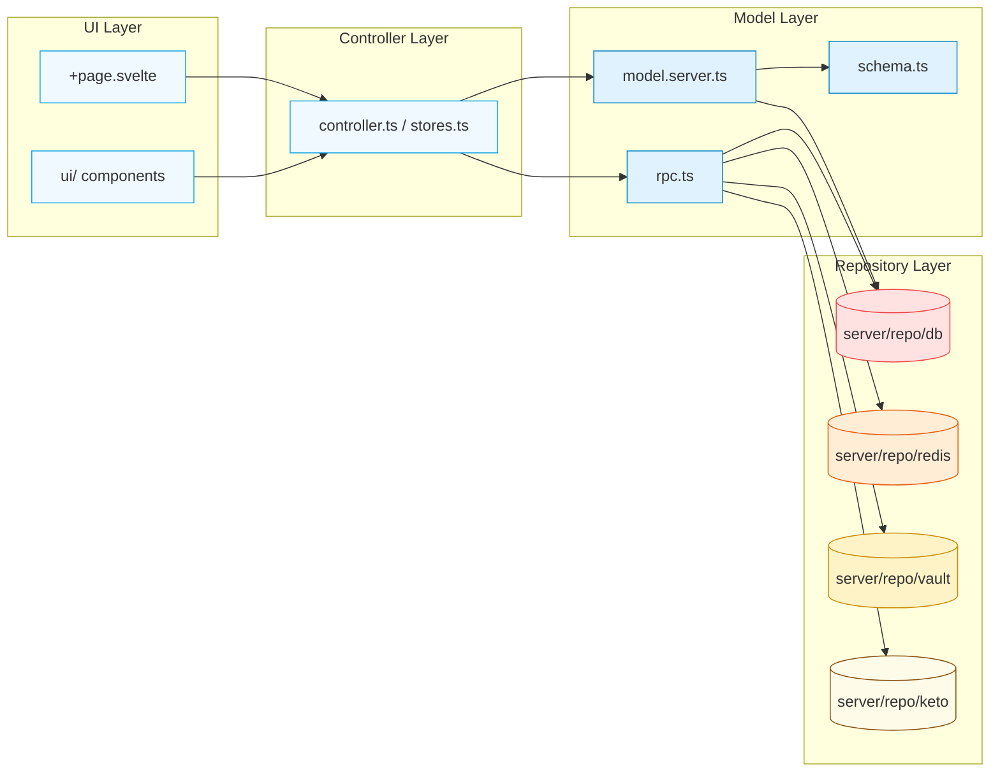
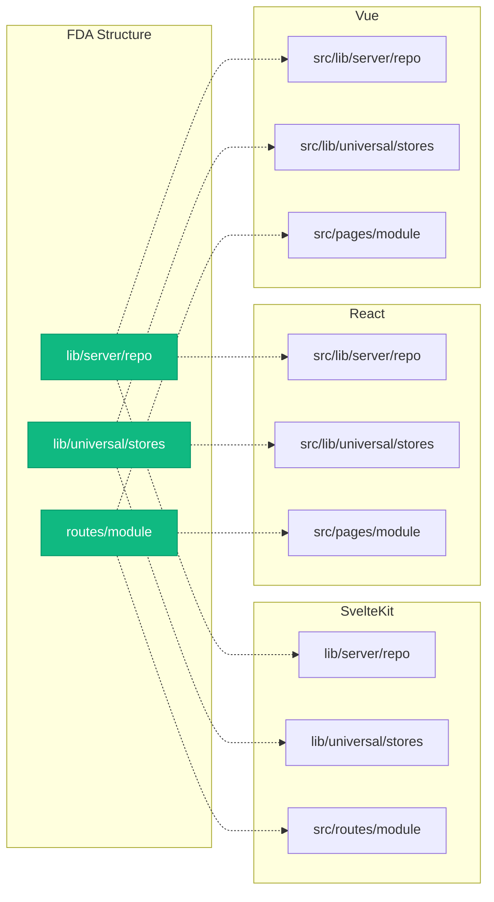

### Детализация слоев:


## 📄 Явные контракты (File Contracts)

Каждый файл внутри домена имеет **строго определённую роль и набор экспортов**:

### Для чего нужен каждый файл и что он экспортирует:

#### `schema.ts` (пример на Drizzle ORM)
```typescript
// Строго: только схемы для ORM
// Никакой логики, только декларативное описание сущностей
export const users = pgTable(...)
export const posts = pgTable(...)
```

#### `model.server.ts`
```typescript
// Бизнес-логика работы с данными через repo
// Экспортирует операции, процессы, транзакции
export const getUserById = async (id: string) => { ... }
export const createUser = async (data: CreateUserInput) => { ... }
```

#### `rpc.ts`
```typescript
// Обслуживание запросов, применение моделей, хендлинг ошибок
// Экспортирует ручки/эндпоинты для фронтенда и других потребителей
export const authenticateUser = async (credentials: Credentials) => { ... }
export const generateToken = async (userId: string) => { ... }
```

#### `state.ts` / `stores.ts`
```typescript
// Работа с UI-состоянием
// Экспортирует реактивные stores и обработчики ввода
export const userStore = derived(...)
export const navigateToProfile = (userId: string) => { ... }
```

#### `+page.svelte` / `index.vue` / `page.tsx`
```tsx
// Непосредственный UI с версткой
// Ничего не экспортируем, применяем state/stores 
import { userStore, navigateToProfile } from './stores.ts'
...
<button on:click={navigateToProfile}>...</button
```

#### `policy.ts`
```typescript
// Описание политик авторизации
// Экспортирует правила доступа
export const canEditUser = (user: User, target: User) => { ... }
export const policy = { ... }
```

#### `utils.ts`
```typescript
// Вспомогательные функции модуля
// Экспортирует утилиты, не подходящие в другие категории
export const formatUserDisplay = (user: User) => { ... }
```

#### `constants.ts`
```typescript
// Константы и enum
// Экспортирует только const/enum
export const USER_ROLES = { ADMIN: 'admin', USER: 'user' }
export const MAX_UPLOAD_SIZE = 1024 * 1024 * 5
```

#### `templates.ts`
```typescript
// Шаблоны форм и состояний
// Экспортирует структуры для formik/yup или аналогов
export const userFormSchema = object({ ... })
export const initialFormState = { ... }
```

#### `types.ts`
```typescript
// Типы и интерфейсы
// Экспортирует только type/interface
export interface User { ... }
export type AuthResult = { success: boolean; message?: string }
```

#### `index.ts`
```typescript
// Центральный экспорт модуля
// Экспортирует все экспортируемые API
export * from './model.server'
export * from './rpc'
export * from './controller'
export * from './constants'
export * from './types'
```

---

## 🔄 Dependency Flow (Направление зависимостей)



---

### Маппинг на другие фреймворки:



### Примеры маппинга:
В зависимости от вашего мета-фреймворка структура и названия папок и файлов могут отличаться. Но это не влияет на общую концепцию 
| SvelteKit | Next | Nuxt |
|-----------|-------|-----|
| `domain/+page.svelte` | `domain/page.tsx` | `domain/index.vue` |
| `domain/+page.server.ts` | `src/pages/action.ts` | `domain/setup.ts` |
| `domain/rpc.ts` | `domain/rpc.ts` | `src/pages/.../rpc.ts` |
| `domain/+server.ts` | `domain/endpoints.ts` | `/server/api/domain/.ts` |
| `domain/model.ts` | `domain/model.ts` | `domain/model.ts` |

---