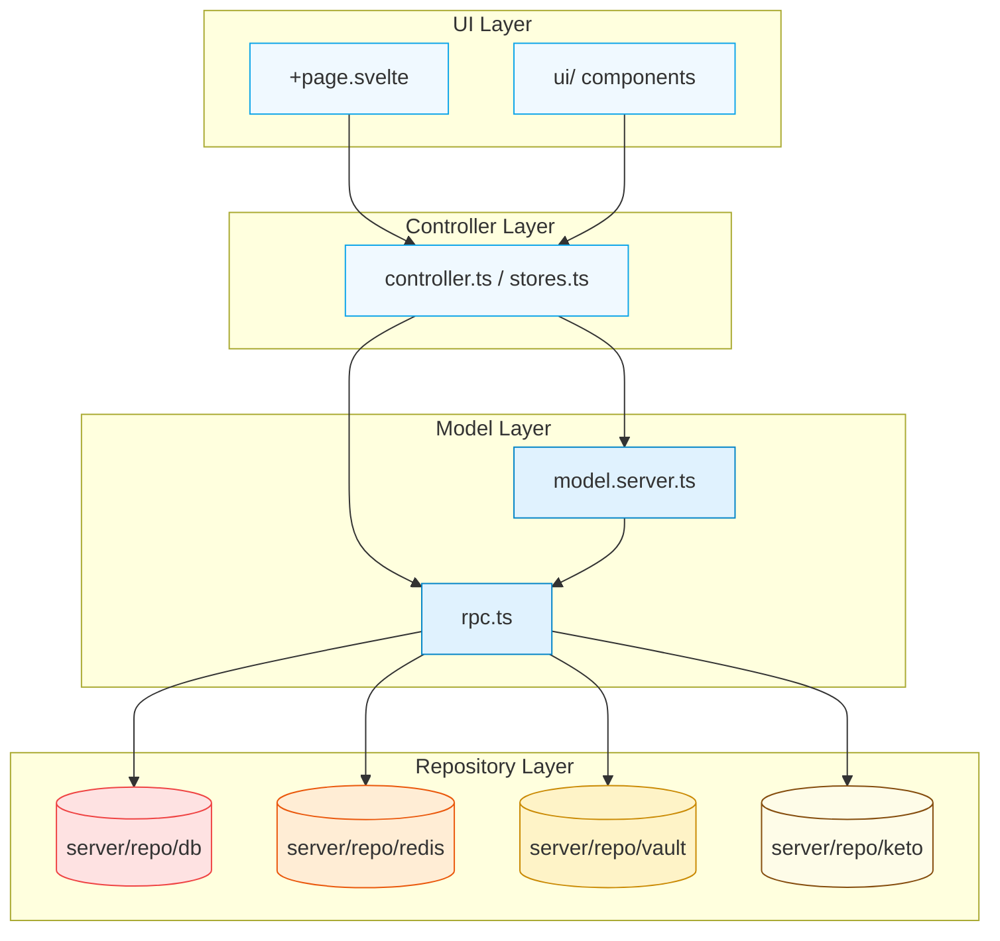
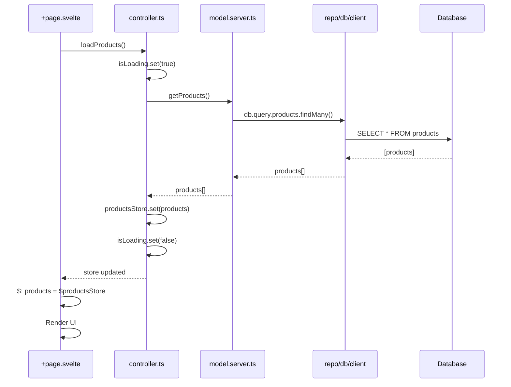

# Data Flow в FDA

---

## 🔄 Структура зависимостей



---

## 🚫 Запрещённые импорты

### 1. UI → repo/* (직접ный импорт)

```
❌ Плохо:
import { db } from '$lib/server/repo/db/client'

✅ Хорошо:
import { getProducts } from './model.server'
```

**Почему:**
- Нарушение слоистой архитектуры
- Слабая тестируемость
- Смешение ответственности

---

### 2. UI → rpc/* (прямой импорт)

```
❌ Плохо:
import { getProducts } from './rpc'

✅ Хорошо:
import { loadProducts } from './controller'
```

**Почему:**
- Контроллер должен управлять вызовами RPC
- Состояние должно обрабатываться в контроллере
- UI должен работать только с состоянием

---

### 3. UI → model.server/* (прямой импорт)

```
❌ Плохо:
import { getProducts } from './model.server'

✅ Хорошо:
import { loadProducts } from './controller'
```

**Почему:**
- Модель — внутренняя логика
- Контроллер управляет моделью
- UI должен получать данные через контроллер

---

### 4. Controller → ui/* (прямой импорт)

```
❌ Плохо:
import { showToast } from './ui/Toast'

✅ Хорошо:
// Не делать! Контроллер не должен знать про UI
```

**Почему:**
- Контроллер не должен зависеть от UI
- Слабая связанность
- Нарушение Separation of Concerns

---

### 5. Model → UI (прямой импорт)

```
❌ Плохо:
import { showToast } from './ui/Toast'

✅ Хорошо:
// Модель не должна знать про UI
```

**Почему:**
- Модель — чистая логика
- Не должно быть side effects
- Модульность

---

## ✅ Правильные импорты

### 1. UI → Controller

```typescript
// +page.svelte
<script lang="ts">
  import { productsStore, loadProducts } from './controller'
  import { formatCurrency } from './utils'
  
  // Подписка на store
  $: products = $productsStore
  
  // Вызов действия
  onMount(() => {
    loadProducts()
  })
</script>

<div class="products">
  {#each $products as product}
    <ProductCard
      title={product.name}
      price={formatCurrency(product.price)}
    />
  {/each}
</div>
```

---

### 2. Controller → Model

```typescript
// controller.ts
import { getProducts, getProductById } from './model.server'

export const loadProducts = async () => {
  isLoading.set(true)
  try {
    const products = await getProducts()
    productsStore.set(products)
  } finally {
    isLoading.set(false)
  }
}

export const selectProduct = async (id: string) => {
  selectedProduct.set(await getProductById(id))
}
```

---

### 3. Controller → RPC

```typescript
// controller.ts
import { getProductsByCategory as getProductsByCategoryRpc } from './rpc'

export const loadProductsByCategory = async (categoryId: string) => {
  isLoading.set(true)
  try {
    const { products } = await getProductsByCategoryRpc({ categoryId })
    productsStore.set(products)
  } finally {
    isLoading.set(false)
  }
}
```

---

### 4. Model → Repo

```typescript
// model.server.ts
import { db } from '$lib/server/repo/db/client'
import { products } from '$lib/server/repo/db/schema'
import { eq } from 'drizzle-orm'

export const getProducts = async (): Promise<Product[]> => {
  return await db.query.products.findMany()
}

export const getProductById = async (id: string): Promise<Product | null> => {
  return await db.query.products.findFirst({
    where: eq(products.id, id),
  })
}
```

---

### 5. RPC → Model + Repo

```typescript
// rpc.ts
import { getProducts, getProductById } from './model.server'
import { db } from '$lib/server/repo/db/client'
import { products } from '$lib/server/repo/db/schema'
import { eq } from 'drizzle-orm'

export const getProductsByCategory: Rpc<'products/getByCategory'> = async ({ categoryId }) => {
  // Можно использовать model
  const productsList = await getProductsByCategory(categoryId)
  
  // Или напрямую repo
  const items = await db.query.products.findMany({
    where: eq(products.categoryId, categoryId),
  })
  
  return { products: items }
}
```

---

## 🧪 Пример полного data flow

### Сценарий: Отображение списка товаров



### Реализация:

```typescript
// +page.svelte
<script lang="ts">
  import { productsStore, isLoading, loadProducts } from './controller'
  import { PageTitle } from './ui'
  
  onMount(() => {
    loadProducts()
  })
</script>

<PageTitle>Products</PageTitle>

{#if $isLoading}
  <LoadingSpinner />
{:else}
  <div class="products">
    {#each $products as product}
      <ProductCard {product} />
    {/each}
  </div>
{/if}
```

```typescript
// controller.ts
import { writable } from 'svelte/store'
import { getProducts } from './model.server'

export const productsStore = writable<Product[]>([])
export const isLoading = writable(false)

export const loadProducts = async () => {
  isLoading.set(true)
  try {
    const products = await getProducts()
    productsStore.set(products)
  } finally {
    isLoading.set(false)
  }
}
```

```typescript
// model.server.ts
import { db } from '$lib/server/repo/db/client'

export const getProducts = async (): Promise<Product[]> => {
  return await db.query.products.findMany()
}
```

---

## 🎯 Принципы правильного data flow

### 1. **Single Source of Truth**

Каждое состояние имеет **один источник правды** — store в контроллере.

```
✅ Хорошо:
- Один store для списка товаров
- Все изменения через контроллер

❌ Плохо:
- Несколько store с одними данными
- Прямые обновления из UI
```

---

### 2. **Unidirectional Data Flow**

Данные течут в одном направлении:

```
UI → Controller → Model → Repo → Database
UI ← Controller ← Model ← Repo ← Database
```

---

### 3. **Separation of Concerns**

Каждый слой имеет свою ответственность:

| Слой | Ответственность |
|------|----------------|
| UI | Отображение, ввод |
| Controller | Управление состоянием, вызовы |
| Model | Логика работы с данными |
| RPC | Бизнес-логика |
| Repo | Подключение к источникам |

---

### 4. **Testability**

Каждый слой можно тестировать изолированно:

```typescript
// test/model.test.ts
import { getProducts } from './model.server'

test('should get products', async () => {
  const products = await getProducts()
  expect(products).toHaveLength(10)
})

// test/controller.test.ts
import { loadProducts, productsStore } from './controller'

test('should load products', async () => {
  await loadProducts()
  expect($productsStore).toHaveLength(10)
})
```

---

## 🔗 Следующие шаги

→ [FAQ и Checklist](/07-faq-checklist) — частые вопросы и проверки
